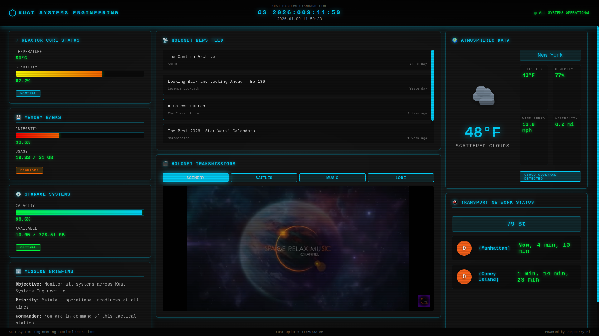

# 🌟 Kuat Systems Dashboard

A Star Wars-themed tactical display optimized for Raspberry Pi and curved/ultra-wide monitors. Transform your display into a Kuat Systems Engineering Command Center with real-time system monitoring, atmospheric data, news feeds, transit information, and immersive Star Wars video content.



## ✨ Features

### Core Modules

- **⏰ Chronometer**: Kuat Systems Standard Time with Earth date/time display
- **🌡️ Reactor Core Status**: Real-time CPU temperature and stability monitoring
- **💾 Memory Banks**: RAM usage with integrity indicators
- **💿 Storage Systems**: Disk space capacity tracking
- **🌍 Atmospheric Data**: Live weather information with animated weather icons (rain, sun, clouds, snow, thunder, fog)
- **📡 HoloNet News Feed**: Real-time Star Wars book/comic news from Youtini with intelligent caching
- **🚇 Transit Network Monitor**: NYC subway real-time arrival times (with station filtering and direction separation)
- **🎬 HoloNet Transmissions**: Star Wars YouTube video feed with toggleable content categories:
  - **Scenery**: Ambient Star Wars landscapes and environments
  - **Battles**: Epic lightsaber duels and space battles
  - **Music**: Official Star Wars soundtracks
  - **Lore**: Star Wars history and lore explained
- **ℹ️ Mission Briefing**: Commander status and tactical objectives

### Aesthetics

- **Imperial Theme**: Dark palette with cyan/red accent colors
- **Star Wars Fonts**: Styled typography reminiscent of Kuat systems interfaces
- **CRT Effects**: Authentic scanlines and flicker effects for retro-futuristic appeal
- **Curved Display Optimized**: Layout designed for 21:9 and 32:9 aspect ratios
- **Responsive Design**: Adapts to various screen sizes

## 🛠️ Hardware Requirements

- **Raspberry Pi 4 or 5** (recommended for smooth performance)
- **Large curved/ultra-wide monitor** (21:9, 32:9, or standard 16:9 works too)
- **8GB+ SD Card** for Raspberry Pi OS
- **Keyboard/Mouse** for initial setup (optional after configuration)

## 📋 Prerequisites

- Raspberry Pi OS (Bullseye or newer)
- Python 3.7+
- Internet connection (for weather data and news feeds)

## 🚀 Quick Start

### 1. Clone the Repository

```bash
cd ~
git clone https://github.com/olino3/star-wars-dashboard.git
cd star-wars-dashboard
```

### 2. Run the Installer

```bash
chmod +x setup.sh
./setup.sh
```

The installer will:
- Install system dependencies (Python, Chromium, etc.)
- Set up a Python virtual environment
- Install Python packages
- Create a systemd service for auto-start
- Configure kiosk mode
- Optionally configure weather API

### 3. Test the Dashboard

```bash
# The service should auto-start, but you can test it manually:
chromium-browser http://localhost:5000
```

### 4. Enable Kiosk Mode on Boot

Kiosk mode is automatically configured! Just reboot:

```bash
sudo reboot
```

The dashboard will launch full-screen on startup.

## 🗑️ Uninstallation

To remove the dashboard autostart, kiosk mode, and systemd service:

```bash
chmod +x uninstall.sh
./uninstall.sh
```

The uninstaller will:
- Stop and disable the systemd service
- Remove the autostart desktop entry
- Remove the kiosk launcher script
- Optionally remove the Python virtual environment
- Optionally remove your `.env` configuration

**Note:** Project files are preserved by default. To completely remove the dashboard:

```bash
rm -rf ~/star-wars-dashboard
```

## ⚙️ Configuration

### Weather API (Optional but Recommended)

To get real weather data instead of mock data:

1. Sign up for a free API key at [OpenWeatherMap](https://openweathermap.org/api)
2. Create a `.env` file in the project root:

```bash
OPENWEATHER_API_KEY=your_api_key_here
WEATHER_LOCATION=London
```

3. Restart the service:

```bash
sudo systemctl restart kuat-systems-dashboard.service
```

### NYC Subway Configuration (Optional)

To enable real-time subway arrival times:

1. Find your station ID at [MTA Stations CSV](http://web.mta.info/developers/data/nyct/subway/Stations.csv)
2. Add to your `.env` file:

```bash
SUBWAY_CITY=NYC
SUBWAY_STATION_ID=D17  # Example: 7th Ave-53rd St
```

3. Restart the service:

```bash
sudo systemctl restart kuat-systems-dashboard.service
```

The system will automatically:
- Download and cache MTA station data on first run
- Filter trains to only those stopping at your station
- Separate arrivals by route and direction
- Update every 60 seconds

### YouTube API Configuration (Optional)

To enable dynamic Star Wars video content in the HoloNet Transmissions panel:

1. Create a project in [Google Cloud Console](https://console.cloud.google.com/)
2. Enable the YouTube Data API v3
3. Create an API key
4. Add to your `.env` file:

```bash
YOUTUBE_API_KEY=your_youtube_api_key_here
```

5. Restart the service:

```bash
sudo systemctl restart kuat-systems-dashboard.service
```

The system will:
- Cache video IDs for 24 hours to respect API quota limits
- Automatically rotate through videos every 5 minutes
- Fall back to curated videos if API is unavailable
- Support four content categories: Scenery, Battles, Music, Lore
- Update every 60 seconds

### News Cache Refresh (Optional)

For optimal performance, set up hourly news cache refresh:

```bash
# Edit crontab
crontab -e

# Add this line (adjust path to your installation):
0 * * * * cd /home/pi/star-wars-dashboard/backend && /home/pi/star-wars-dashboard/venv/bin/python3 cron/refresh_news.py >> logs/youtini.log 2>&1
```

This pre-warms the news cache hourly, ensuring fast load times.

### Customize Update Intervals

Edit `frontend/js/app.js` and modify these values (in milliseconds):

```javascript
this.chronoInterval = 1000;      // Chronometer: 1 second
this.systemInterval = 5000;      // System stats: 5 seconds
this.weatherInterval = 300000;   // Weather: 5 minutes
this.newsInterval = 600000;      // News: 10 minutes
this.subwayInterval = 60000;     // Subway: 1 minute
```

### Add Custom News Sources

The dashboard uses Youtini.com as its news source with intelligent web scraping and caching. The implementation includes:
- Automatic cache refresh every 55 minutes
- Exponential backoff retry logic
- Parsing of article titles, dates, and categories
- Optional cron job for hourly pre-warming

If you want to modify the news source, edit `backend/utils/youtini.py` or replace with your own RSS parser in `backend/app.py`.

## 🗂️ Project Structure

```
star-wars-dashboard/
├── backend/
│   ├── app.py                 # Flask API server
│   ├── requirements.txt       # Python dependencies
│   ├── cron/
│   │   └── refresh_news.py    # Hourly news cache refresh script
│   ├── data/
│   │   ├── stations.db        # NYC subway stations database
│   │   └── youtube_cache.json # YouTube video IDs cache (24-hour)
│   └── utils/
│       ├── system_stats.py    # System monitoring
│       ├── weather.py         # Weather data fetching (OpenWeatherMap)
│       ├── subway.py          # NYC subway real-time data
│       ├── youtube.py         # YouTube API proxy with caching
│       └── youtini.py         # Star Wars news scraper with caching
├── frontend/
│   ├── index.html            # Main dashboard HTML
│   ├── css/
│   │   ├── main.css          # Core styles & weather animations
│   │   └── animations.css    # Animations & effects
│   ├── js/
│   │   ├── app.js            # Main application logic
│   │   └── youtube_feed.js   # YouTube video feed module
│   └── fonts/                # Star Wars fonts (add your own)
├── docs/
│   └── screenshots/          # Dashboard screenshots
├── config/
│   ├── autostart.desktop     # Autostart configuration
│   └── launch-kiosk.sh       # Kiosk mode launcher (created by setup.sh)
├── setup.sh                  # Installation script
├── uninstall.sh              # Uninstallation script
├── run-dev.sh                # Development server launcher
└── README.md                 # This file
```

## 🎨 Adding Star Wars Fonts

For the best experience, download Star Wars fonts like "Star Jedi" or "Aurebesh":

1. Download fonts from [DaFont](https://www.dafont.com/star-jedi.font) or similar
2. Place `.ttf` files in `frontend/fonts/`
3. Update `frontend/css/main.css`:

```css
@font-face {
    font-family: 'StarJedi';
    src: url('../fonts/Starjedi.ttf') format('truetype');
}

.logo-text {
    font-family: 'StarJedi', monospace;
}
```

## 🐛 Troubleshooting

### Dashboard doesn't start on boot

Check if the service is running:

```bash
sudo systemctl status kuat-systems-dashboard.service
```

View logs:

```bash
sudo journalctl -u kuat-systems-dashboard.service -f
```

### Weather data not updating

1. Verify your API key is correct in `.env`
2. Check the backend logs for API errors
3. Test the API endpoint manually:

```bash
curl http://localhost:5000/api/weather
```

### Performance issues on Raspberry Pi

1. Reduce update intervals in `frontend/js/app.js`
2. Disable CRT flicker effect in `frontend/css/main.css`:

```css
.crt-flicker {
    display: none;  /* Disable for better performance */
}
```

## 🔧 Manual Control

### Start/Stop the Backend Service

```bash
sudo systemctl start kuat-systems-dashboard.service
sudo systemctl stop kuat-systems-dashboard.service
sudo systemctl restart kuat-systems-dashboard.service
```

### Launch Kiosk Mode Manually

```bash
./config/launch-kiosk.sh
```

### Disable Auto-Start

```bash
sudo systemctl disable kuat-systems-dashboard.service
rm ~/.config/autostart/kuat-systems-dashboard.desktop
```

## 🌐 API Endpoints

The backend exposes these REST API endpoints:

| Endpoint | Description |
|----------|-------------|
| `GET /` | Main dashboard page |
| `GET /api/system` | System statistics (CPU, RAM, Disk) |
| `GET /api/weather` | Weather/atmospheric data (OpenWeatherMap) |
| `GET /api/chronometer` | Current time (Kuat Systems Standard + Earth) |
| `GET /api/news` | HoloNet news feed (Youtini) |
| `GET /api/subway` | Transit/subway arrival times (MTA) |
| `GET /api/youtube/<category>` | YouTube video IDs (scenery, battles, music, lore) |
| `GET /health` | Service health check |

## 🎯 Future Enhancements

- [ ] Support for other transit systems (London Underground, BART, etc.)
- [ ] Network monitoring (show active devices as "Fleet Status")
- [ ] Smart home integration (control lights as "Reactor Controls")
- [ ] Voice commands (via Google Assistant/Alexa)
- [ ] Multiple themes (Imperial, Rebel Alliance, Mandalorian)
- [ ] Data persistence (historical charts)
- [ ] Multi-language support

## 🤝 Contributing

Feel free to fork this project and submit pull requests! Some ideas:

- Improve theme customization
- Add new data modules
- Optimize performance
- Create alternative themes

## 📜 License

This project is open source and available under the [MIT License](LICENSE).

## ⚡ Credits

Created for Star Wars fans and Raspberry Pi enthusiasts.

**May the Force be with you, Commander!** 🌟

## 📞 Support

If you encounter issues or have questions:

1. Check the [Troubleshooting](#-troubleshooting) section
2. Review the backend logs: `sudo journalctl -u kuat-systems-dashboard.service -f`
3. Open an issue on GitHub with:
   - Your Raspberry Pi model
   - OS version (`cat /etc/os-release`)
   - Error messages/logs

## 🎬 Screenshots

### Main Dashboard View
The full tactical command center with all systems operational, showing real-time data across all modules.


### Dashboard Features
- **Left Panel**: System monitoring (Reactor Core, Memory Banks, Storage Systems, Mission Briefing)
- **Center Panel**: HoloNet News Feed and YouTube Transmissions with category switching
- **Right Panel**: Atmospheric Data with animated weather icons and Transit Network Status

---

**Built with ❤️ for Kuat Systems Engineering**

*This is a fan project and is not affiliated with or endorsed by Lucasfilm Ltd. or Disney.*
